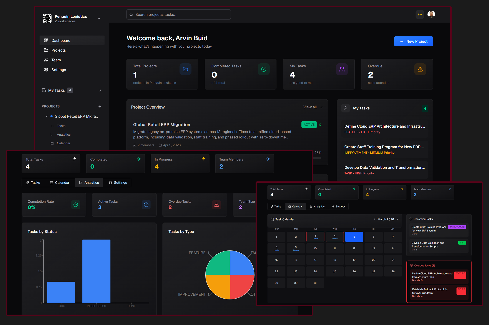

# OrbitPM

A Full-Featured Web-Based Collaboration Project Management System built using PostgreSQL, Express, React and Node.js.

<div align="center">
    
  <br />
  


  </div>
</div>

## Features

- 📁 **Project Creation & Management** — Create and manage projects with full control over status and settings, including the ability to update project information at any time
- ✅ **Task CRUD Functionality** — Create, read, update, and delete tasks within each project with ease
- 👥 **Task Assignment** — Assign tasks to any registered app user or take ownership as the current user
- 💬 **Task Discussion via Chat** — Each task includes a dedicated real-time chat system for focused team discussions and collaboration
- 📊 **Analytics with Charts** — Visualize project progress and task statistics through interactive charts and analytics dashboards
- 📅 **Calendar View** — Monitor and track task statuses through an integrated calendar to keep your team on schedule
- 🔍 **Task Filtering** — Quickly find tasks using flexible filtering options to streamline your workflow
- 📧 **User Invitations via Email** — Invite collaborators to join your project by sending them an email invitation directly from the app
- 🔔 **Real-time Notifications** — Users are instantly notified when they are assigned to a newly created task, ensuring no assignment goes unnoticed

## Usage

### Clone the Repository

```bash
git clone https://github.com/arvinbuid/orbit-pm.git
```

## Add Environment Variables

### Frontend

```bash
VITE_CLERK_PUBLISHABLE_KEY=YOUR_OWN_CLERK_PUBLISHABLE_KEY
VITE_BASEURL=http://localhost:5001
```

### Backend

```bash
PORT=5001
NODE_ENV='development'

CLERK_PUBLISHABLE_KEY=YOUR_OWN_CLERK_PUBLISHABLE_KEY
CLERK_SECRET_KEY=YOUR_OWN_CLERK_SECRET_KEY
CLERK_WEBHOOK_SECRET=YOUR_OWN_CLERK_WEBHOOK_SECRET

DATABASE_URL=YOUR_OWN_NEON_DATABASE_URL
DIRECT_URL=YOUR_OWN_NEON_DIRECT_URL

INNGEST_EVENT_KEY=YOUR_OWN_INNGEST_EVENT_KEY
INNGEST_SIGNING_KEY=YOUR_OWN_INNGEST_SIGNING_KEY

SENDER_EMAIL=YOUR_OWN_BREVO_SENDER_EMAIL
SMTP_USER=YOUR_OWN_BREVO_SMTP_USER
SMTP_PASSWORD=YOUR_OWN_BREVO_SMTP_PASSWORD
```

Note: Make sure to replace the placeholders with your own values and kindly refer to Clerk, Neon, Inngest and Brevo documentation for more information or incase the setup/api change/update in the future (which I'm sure it will).

## Setup and Run the Project

### Frontend

```bash
cd client
npm install
npm run dev
```

### Backend

```bash
# Run in development mode
cd server
npm install
npm run server
```

Open [http://localhost:3000](http://localhost:3000) with your browser to see the result.
